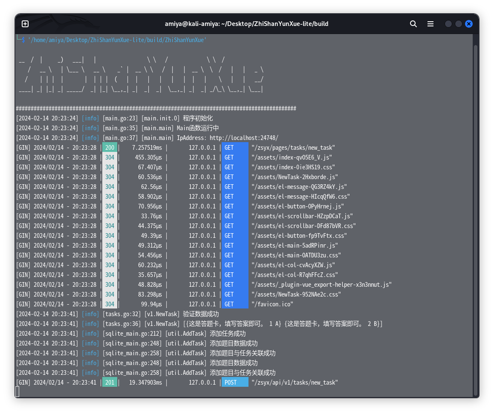

<div align="center">

<h2 align="center" style="font-weight: 600">ZhiShanYunXue</h2>

<p align="center">
    基于Go的<a>至善云学</a>后端
    <br />
    Version: 1.0.0
</p>
</div>

## ✨ 特性

- ✅ 使用 Go 开发 性能至上
- 📔 支持基本功能 新建任务 查看任务情况 任务作答 任务评分

## 📦️ 开发&打包

- 🛠 [配套API文档](https://apifox.com/apidoc/shared-df1fc889-ef10-4dfa-a199-1e75da2160a3)

```shell
# 依赖
go mod tidy

# 打包
go build
```

## 💻 运行

可以集成到至善云学前端使用 或者单独部署

## ☑️ Todo

1. 任务列表

欢迎提 Issue 和 Pull request。

## 📜 开源许可

本项目仅供个人学习研究使用，禁止用于商业及非法用途。

基于 [LGPL-3.0](https://www.gnu.org/licenses/lgpl-3.0.en.html#license-tex) 许可进行开源。

## 🖼️ 截图


